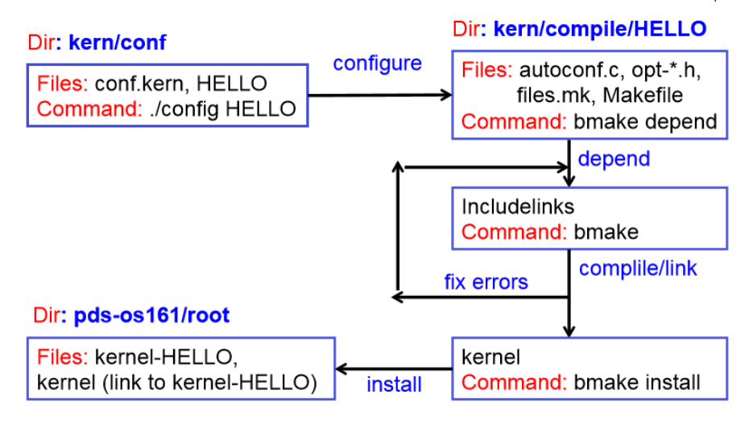

# Table of Contents
- [Table of Contents](#table-of-contents)
- [Tree Structure](#tree-structure)
- [Comandi e Workflow](#comandi-e-workflow)
  - [Far eseguire all'emulatore sys161 il kernel di OS161](#far-eseguire-allemulatore-sys161-il-kernel-di-os161)
  - [Far eseguire all'emulatore sys161 il kernel di OS161 in modalità debug](#far-eseguire-allemulatore-sys161-il-kernel-di-os161-in-modalità-debug)
    - [OPZ.1: Using VSCode](#opz1-using-vscode)
    - [OPZ.2: Without VSCode, manual gdb debugging](#opz2-without-vscode-manual-gdb-debugging)
      - [Funzioni utili in cui piazzare breakpoint](#funzioni-utili-in-cui-piazzare-breakpoint)
  - [Creare nuova versione del kernel](#creare-nuova-versione-del-kernel)
  - [File e strutture dati Interessanti](#file-e-strutture-dati-interessanti)
    - [Threads](#threads)
    - [Gestione memoria](#gestione-memoria)
    - [Synch](#synch)
  - [Eseguire processo utente](#eseguire-processo-utente)
    - [IO](#io)
    - [File system](#file-system)

# Tree Structure
- src: contiene sorgenti, file di configurazione, compilazione ed eseguibili, di os161 e dei
tool utilizzati (è quindi l’area in cui si modifica e ri-compila os161)
    - userland: programmi utente
    - kern: source del kernel
        - conf: kernel configuration
          - config: file bash con comandi che eseguono la configurazione 
          - conf.kern
        - compile: kernel compilation+build
          - DUMBVM: kernel configuration:
            - Definizioni di dispositivi (`defdevice       beep			dev/generic/beep.c`, con, rtclock, random)
            - Configurazioni dipendenti dall'hardware (`include   arch/mips/conf/conf.arch`, `include   arch/sys161/conf/conf.arch`)
            - `defoption hello`
            - Machine mips optfile dumbvm arch/mips/vm/dumbvm.c (se la macchina e' mips e' definito un file opzionale che da una definizione del supporto per la memoria virtuale (traduzione logica-fisica) per i processori mips) (dato che os161 non supporta altre architetture e' come dire che e' opzionale per l'unica opzione disponibile in realta') `optfile hello main/hello.c`
            - elenchi di file da usare per compilare il kernel (`file      proc/proc.c`,...)
            - `optofffile dumbvm   vm/addrspace.c` (quando e' attiva l'opzione dumbvm NON compilare questo file)
            - `defoption semfs` (semafori del file system) + `optfile semfs fs/semfs/semfs_fsops.c`,`semfs_obj.c`,`semfs_vnops.c` (3 file opzionali e con compilazione condizionale: inclusi nel kernel solo se quell'opzione e' attiva) 
            - `Defoption sfs` + `Optfile sfs` (file opzionali e con compilazione condizionale: inclusi nel kernel solo se quell'opzione e' attiva) 
          - DUMBVM-OPT: come DUMBVM con le uniche differenze che debug e' disattivo e ha un'opzione in +: noasserts (versione piu' veloce perche' disabilita alcune parte di codice) 
- root: si tratta del direttorio in cui eseguire il (fare boot del) sistema operativo, ed eventualmente attivare
processi user (è l’area in cui si esegue e si testa il sistema os161)
- tools: pacchetti SW richiesti, binutils, compilatore gcc e debugger gdb, emulatore MIPS sys161
    - tools/bin: mips-harvard-os161-gcc, mips-harvard-os161-gdb (eseguibili in os161/tools/bin)

# Comandi e Workflow
## Far eseguire all'emulatore sys161 il kernel di OS161
1. cd `root`
2. Cambiare `31	mainboard  ramsize=512K  cpus=1` in `31	mainboard  ramsize=1024K  cpus=1` in sys161.conf
3. sys161 kernel

## Far eseguire all'emulatore sys161 il kernel di OS161 in modalità debug

### OPZ.1: Using VSCode

1. Se serve debuggare thread settare `28 random  seed=1` invece di `28 random  autoseed` in `root/sys161.conf` 
2. cd ./root
3. sys161 -w kernel
4. Piazzare breakpoint nel codice/usare la debug console per eseguire i comandi di gdb
5. Esegui debug

### OPZ.2: Without VSCode, manual gdb debugging
Terminal 1:
1. cd ./root
2. sys161 -w kernel
    L'opzione –w mette sys161 in ascolto su un socket, che verra' usato per comunicare cosa sta succedendo dentro sys161 a un altro programma che gira su ubuntu e che si metta in ascolto sullo stesso socket. Non basta pero' un debugger intel/amd per capire cosa sta succedendo nel simulatore architetturale, serve un debugger che conosca il mips (mips-harvard-os161-gdb)
Terminal 2:
1. cd ./root
2. mips-harvard-os161-gdb kernel
3. dir ../src/kern/compile/DUMBVM
    Serve a far trovare a gdb i sorgenti del kernel che sta venendo eseguito
4. target remote unix:.sockets/gdb
    serve per agganciare correttamente il socket

#### Funzioni utili in cui piazzare breakpoint
- main: `kmain`,`menu`
- user mode: `mips_usermode`
- threads: `thread_create()`,`thread_fork()`,`thread_yield`,`thread_destroy`

## Creare nuova versione del kernel
1. Creare file `kern/main/myFunc.c` e `kern/include/myFunc.h`
2. Inserire `#include "myFunc.h"` in `kern/main/main.c` e `kern/main/myFunc.c`
    Per evitare inclusioni multiple serve usare la guardia:
    ```
    #ifndef _HELLO_H_
    #define _HELLO_H_
    ...
    #endif
    ```
    Per evitare di dover cancellare hello(); ogni volta che voglio ricompilare una diversa versione del kernel che non contenga l'opzione hello, devo rendere la definizione e la chiamata della funzione hello, usando una flag associata alla presenza o meno dell'opzione hello nei file di configurazione! Questa flag e' OPT_HELLO, e viene settata automaticamente in fase di configurazione nel file `kern/compile/HELLO/opt-hello.h`. 
    ```
    #include "opt-hello.h" <-----------
    #if OPT_HELLO
    ...
    #endif
    ```
3. Chiamare la nuova funzione dall'interno di `kern/main/main.c`
4. Aggiungere
    ```
    defoption newVersionName
    optfile newVersionName main/myFunc.c
    ```
    a `kern/conf/conf.kern`
5. Aggiungere `kern/conf/newVersionName` copiando config precedente, con una nuova riga `options newVersionName`
    
6. CONFIGURAZIONE: `cd kern/conf && ./config newVersionName`
    in questa fase vengono generati i file kern/compile/opt-nomeOpzione.h di tutte le opzioni presenti in conf.kern. Questi conterrano le flag OPT_NOMEOPZIONE settate a 1 se nel file NOMECONFIG e' presente l'istruzione options NOMEOPZIONE, a 0 altrimenti. Sulla base di questa flag si puo' decidere se eseguire o meno pezzi di codice (dichiarazioni/richiami a funzioni..). Crea anche altri .h e un makefile che verra' usato da bmake per compilare il kernel. 
7. cd `src/kern/compile/newVersionName`
8. COMPILAZIONE+LINKING (BUILD) `bmake depend`
    A partire da tutti i file .c, capisce che .h serve includere, analizza le dipendenze e se non ci sono errori (inclusioni multiple/circolari) inserisce nella cartella NOMECONFIG, oltre a quello che c'era prima in DUMBVM, anche le "include dirs", link a cartelle contenenti .h necessari per compilare il kernel. Serve rifarlo solo nel momento in cui vengano aggiunti/tolti alcuni .h durante la correzione degli errori. 
9.  `bmake`
    build (compile+link)del nuovo kernel (senza errori)->crea file eseguibile kernel nella cartella attuale. Se ho degli errori nel mio codice (.c), non andra' a buon fine, bisognera' correggere gli errori E RIFARE bmake. 
10. INSTALLAZIONE`bmake install`
    si trasferisce il kernel appena creato (kernel) in pds-os161/root/kernel-NOMECONFIG e si aggiorna il symlink "pds-os161/root/kernel" per farlo puntare all'ULTIMO KERNEL INSTALLATO (il kernel-NOMECONFIGPRECEDENTE rimane nella cartella)
    Equivale a
    ```
    [ -d /home/pds/pds-os161/root ] || mkdir /home/pds/pds-os161/root 
    cp kernel /home/pds/pds-os161/root/kernel-HELLO 
    rm -f /home/pds/pds-os161/root/kernel 
    ln -s kernel-HELLO /home/pds/pds-os161/root/kernel 
    ```

## File e strutture dati Interessanti
### Threads
[Thread data structure]: src/kern/include/thread.h

[Thread implementation]: src/kern/thread/thread.c
- runprogram calls thread_fork
  - thread_create
  - switchframe_init
  - thread_make_runnable
- thread_switch
  - switchframe_switch
[Swiframe_switch function]: src/kern/arch/mips/thread/switch.S

[Thread usage example]: src/kern/test/threadtest.c 
- runthreads

### Gestione memoria

[TLB]: src/kern/arch/mips/include/tlb.h

[Address Space]: src/kern/include/addrspace.h

[Dumbvm]: src/kern/arch/mips/vm/dumbvm.c

[Ram (allocatore architecture-dependent)]: src/kern/arch/mips/vm/ram.c
- ram_bootstrap
- ram_stealmem

[Kernel loader]: src/kern/arch/sys161/main/start.S

[MIPS Register Usage]: src/kern/arch/mips/include/kern/regdefs.h

### Synch

[Process Control Block data structure]: /src/kern/include/proc.h

[Disable and enable interrupts]: src/kern/include/spl.h

[Spinlock mutex implementation]: src/kern/thread/spinlock.c

[Semaphore, lock, condition variable, wchan implementation]: /src/kern/thread/synch.c

## Eseguire processo utente

Callstack:

"P testbin/palin" o p testbin/badcall o p testbin/mytest (https://www.youtube.com/watch?v=ACE0BaUcaNI) o km3 10000 (test kmalloc)
	menu_execute
	    cmd_dispatch: parsa il comando inserito e decide che funzione eseguire in base al contenuto di cmdtable. Ex. cmdtable[i]="p",address of cmdprog with argument testbin/palin
	        cmd_prog: Command for running an arbitrary userlevel program
	            common_prog: Common code for cmd_prog and cmd_shell
	                proc_create_runprogram: Create a process for the new program to run in. (alloca PCB: struct proc+memoria) con il compito di eseguire la funzione cmd_progthread.
	            	
                    result = thread_fork(   args[0] /* thread name */,
		                                    proc /* new process */,
		                                    cmd_progthread /* thread function */,
		                                    args /* thread arg */,
                                            nargs /* thread arg *);

                	    thread_fork: Alloca struct thread che andra' a eseguire il programma scelto!
                        newthread = thread_create(name);
	                    
	                    newthread->t_stack = kmalloc(STACK_SIZE); /* Allocate a KERNEL stack -> Stiamo creando un Kernel thread! */
	                    newthread->t_cpu = curthread->t_cpu; /* Thread subsystem fields */
                    
	                     /* Attach the new thread to its process */
	                    if (proc == NULL) {
	                    	proc = curthread->t_proc; /* Associa il nuovo thread creato al processo padre!*/
	                    }
	                    result = proc_addthread(proc, newthread); 
	                    if (result) {
	                    	/* thread_destroy will clean up the stack */
	                    	thread_destroy(newthread);
	                    	return result;
	                    }
                    
	                    /*
	                     * Because new threads come out holding the cpu runqueue lock
	                     * (see notes at bottom of thread_switch), we need to account
	                     * for the spllower() that will be done releasing it.
	                     */
	                    newthread->t_iplhigh_count++;
                    
	                    /* Set up the switchframe so entrypoint() gets called */
	                    switchframe_init(newthread, entrypoint, data1, data2); /* entrypoint -> cmd_progthread */
                    
	                    /* Lock the current cpu's run queue and make the new thread runnable */
	                    thread_make_runnable(newthread, false);

                            thread_startup:	/* Call the function entrypoint */ 
                                cmd_progthread (wrapper): Function for a thread that runs an arbitrary userlevel program by name
                                    runprogram: Load program "progname" and start running it in usermode.
                                    1. Open the file
                                        struct vnode *v; /* File Control Block che punta al file ELF progname */
                                            - vn_refcount: reference count
                                            - vn_countlock: spinlock per accedere in mutua esclusione al reference count 
                                            - *vn_fs: puntatore al file system in uso in questo momento (emufs o sfs)
                                            - *vn_ops: puntatore a una struct contenente puntatori a funzioni: operazioni disponibili in quel file system (emufs_read, sfs_read,..)
                                            - *vn_data: puntatore a dei dati 
                                        result (success/failure) = vfs_open(progname, O_RDONLY, 0, &v); (vfs: virtual file system che si puo' usare indipendentemente da quale viene usato sotto: emu file system si appoggia al fs della macchina host, simple fs vero fs)
                                    2. Create a new address space (dumbvm alloca contiguamente user stack -> si puo' estendere con paginazione)
                                        - vaddr_t as_vbase1; -> code
                                        - vaddr_t as_vbase2; -> data 
                                        - paddr_t as_stackpbase; -> user stack
                                    3. Switch to it and activate it: fare in modo che il processo possa fare in modo di fare traduzione indirizzi logici-fisici.
                                    4. Load the executable
                                        result = load_elf(struct vnode * :v, vaddr_t * :&entrypoint );: Load an ELF executable user program into the current address space (dentro i segmenti di code e data)
                                            1. Prende address space dalla struct del processo corrente
                                                struct addrspace *as = proc_getas();
                                            2. Read the number of executable header from offset 0 in the file.
                                                Prima lettura dell'header del file per capirne la dimensione e allocare spazio necessario
                                                Elf_Ehdr eh;   /* Executable header = header per il segmento codice*/
                                            	struct iovec iov;
                                                struct uio ku; /* Descrive operazione IO da effettuare */
	                                                struct iovec     *uio_iov;	/* Data blocks : vettore di posizioni di partenza da cui leggere */
	                                                    void *iov_base;			/* user-supplied pointer : ph program header che vogliamo leggere in kernel mode | user segment da leggere in user mode (indirizzo logico) (segmento di dati o di codice) */
                                                        size_t iov_len;			/* Length of data: dato da leggere */
	                                                unsigned          uio_iovcnt;	/* Number of iovecs */
	                                                off_t             uio_offset;	/* Desired offset into object: dove leggere*/
	                                                size_t            uio_resid;	/* Remaining amt of data to xfer: quanto manca da leggere */
	                                                enum uio_seg      uio_segflg;	/* What kind of pointer we have: UIO_SYSSPACE -> usa traduzione logico-fisica del Kernel (offset kseg0) | UIO_USERSPACE -> usa traduzione logico-fisica dell'User da iov_base a as_pbase2 */
	                                                enum uio_rw       uio_rw;	/* Whether op is a read or write: UIO_READ */
	                                                struct addrspace *uio_space;	/* Address space for user pointer: NULL -> non serve spazio di indirizzamento in kernel | puntatore all'address space del processo, che a sua volta contiene as_pbase2 e as_npages2 che fanno riferimento allo stesso user segment contenuto in iov_base (indirizzo fisico) */

                                                uio_kinit(&iov, &ku, &eh, sizeof(eh), 0, UIO_READ);
                                                    Convenience function che si puo' usare se vogliamo fare io da memoria kernel
                                                    Prima lettura da file che vediamo! Possiamo usare la stessa tecnica per implementare sycall read e write!

                                                    Funzione predispone la struttura dati per effettuare la lettura: VOP_READ 
                                                    void uio_kinit(struct iovec *iov, /* */
                                                        struct uio *u, /* */
                                                        void *kbuf, /* Destinazione read */
                                                        size_t len, /* Dimensione destinazione read */
                                                        off_t pos,
                                                        enum uio_rw rw);
                                                v: puntatore al file control block del file ELF da cui si legge
                                                ku: struct uio che descrive il tipo di read da effettuare (indirizzo di partenza in ku->iovec->iov_base, dimensione in ku->iovec->iov_len, altre opzioni per definire offset, tipo di operazione)
                                                
	                                            result=VOP_READ(v, &ku);/*! VOP_READ e' una macro che punta a vops.vop_read, che puntera' a emufs_read o sfs_read a seconda del fs in uso !*/
                                                    emufs_read
                                                        emu_read
                                                            emu_doread:
                                                            1. acquisisce lock
                                                            2. scrive in registri virtuali per attivare operazione di IO
                                                                Invece di guardare dispositivo guardano il file system dell'host 
                                                            3. attende completamento operazione
                                                                emu_waitdone(sc)
                                                                membar_load_load: memory barrier waiting for completion
                                                            4. trasferisce dati alla destinazione
                                                                result = uiomove(sc->e_iobuf, /* buffer su cui il dispositivo virtuale ha acquisito dati */
                                                                emu_rreg(sc, REG_IOLEN),
                                                                uio);:  
                                                    or
                                                    sfs_read
                                                        sfs_io
                                                            sfs_blockio: disco e' dispositivo a blocchi (non a caratteri)
	                                                        1. /* Get the block number within the file: generare numero di blocco sul file */
	                                                        fileblock = uio->uio_offset / SFS_BLOCKSIZE;
	                                                        2. /* Look up the disk block number: calcolare da numero di blocco logico a numero di blocco fisico */
                                                            result = sfs_bmap(sv, fileblock, doalloc, &diskblock);
                                                            3. /* Do the IO : IO di un blocco */
                                                            result = sfs_rwblock(sfs, uio);

                                            3. Leggo gli executable header = program header = segment header = header di ogni segmento (codice e dati)
                                                Elf_Phdr ph;   /* "Program header" = segment header */
                                                eh.e_phnum = numero di program header presenti nell'header
                                                for (i=0; i<eh.e_phnum; i++) {
                                                    /* Leggo ogni program header */
                                                    off_t offset = eh.e_phoff + i*eh.e_phentsize;
		                                            uio_kinit(&iov, &ku, &ph, sizeof(ph), offset, UIO_READ);
                                            
		                                            result = VOP_READ(v, &ku);

                                                    /* Informazioni contenute nel program header usate per allocare la memoria che servira' ad allocare il segmento grosso memsz a partire da vaddr */
                                                    result = as_define_region(as,
					                                    ph.p_vaddr,
                                                        ph.p_memsz,
					                                    ph.p_flags & PF_R,
					                                    ph.p_flags & PF_W,
					                                    ph.p_flags & PF_X);
                                                }
                                            4. Seconda lettura per leggere davvero il file
                                                for (i=0; i<eh.e_phnum; i++) {
                                                    /* Leggo ogni segmento (codice e dati ) */
                                                    off_t offset = eh.e_phoff + i*eh.e_phentsize;
		                                            uio_kinit(&iov, &ku, &ph, sizeof(ph), offset, UIO_READ);
                                            
		                                            result = VOP_READ(v, &ku);

                                                    result = load_segment(as,
                                                        v,
                                                        ph.p_offset, /* offset nel file da cui vado a leggere questo segmento, per poi piazzarlo a partire da vaddr */
                                                        ph.p_vaddr, /* virtual address di partenza a cui devo piazzare questo segmento */
				                                        ph.p_memsz, /* dimensione in memoria logica */
                                                        ph.p_filesz, /* dimensione nel file -> puo' essere un po' piu' piccola della dimensione in memoria logica (tutti 0 rimossi) */
				                                        ph.p_flags & PF_X);
                                                }
                                            5. as_complete_load(as);
                                            6. *entrypoint = eh.e_entry; /* salva entrypoint a partire da cui dovra' essere eseguito il programma */ 
                                    5. Si chiude il file vfs_close(v); 
                                    6. Define the user stack in the address space (non predisposto dalla load_elf, viene aggiunto)
                                        	result = as_define_stack(as, &stackptr);
                                    7. Warp to user mode
                                        enter_new_process: go to user mode after loading an executable
                                            mips_usermode
                                                asm_usermode

In alternativa le syscalls `pid fork()` e `int execv(const char* program, char ** args)` possono essere usate per eseguire lo stesso o un altro processo utente.

N.B. We can't keep debugging inside the user code, we can just debug the kernel!

[Running a user program]: /src/kern/syscall/runprogram.c

[enter_new_process]: /src/kern/arch/mips/locore/trap.c

[syscall handler]: /src/kern/arch/mips/syscall/syscall.c

[Load ELF executable into memory]: src/kern/syscall/loadelf.c

### IO
src/kern/vfs
src/kern/fs

[Kernel IO Subsystem] /src/kern/console.h, .c

[Serial interface drivers]
- lser.h
  - lser_softc
- lser.c: driver interfaccia seriale

Semaforo parte a 1->P(): 0 -> V() di nuovo 1
putch->putch_intr P() ->lser_write->lamebus_interrupt->lser_irq->con_start V()

getch->getch_intr -> lamebus_interrupt->lser_irq->con_input

[LAMEBUS specification]: src/kern/dev/lamebus/lamebus.h

### File system

struct openfile